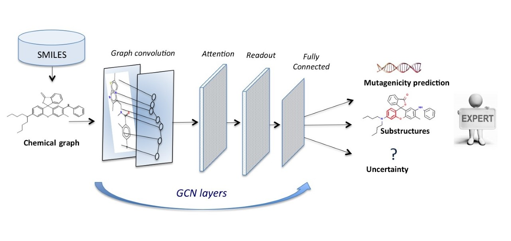

# Gini_Hung-QSAR_GCN
<p align="center">
  

</p>
## General info
This project is QSAR modeling without descriptors using graph convolutional neural networks:
The case of mutagenicity prediction

Two models based on Graph Convolutional Neural Networks (GCN) are presented, with and without  Bayesian estimation of the prediction uncertainty, to study mutagenicty.
	
## Technologies
Project is created with:
* Python version: 3.7.5
* Tensorflow version: 1.13.1
* Rdkit version: 2019.09.1
	
## Setup
To install the dependencies:

```
  $ conda create -c conda-forge -n my-rdkit-env rdki
  $ conda activate my-rdkit-env
  pip install tensorflow
  pip install numpy
  ```
  
