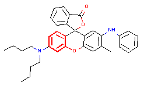
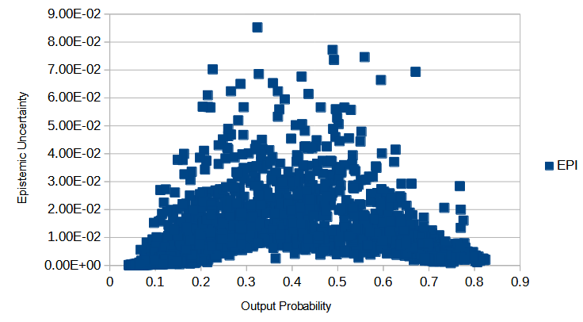
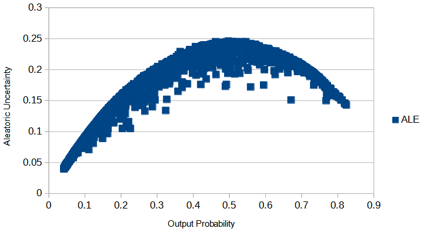

# Gini_Hung-QSAR_GCN

## General info

This project is QSAR modeling without descriptors using graph convolutional neural networks:The case of mutagenicity prediction
The research is published in Springer and Elsevier:
<p align="center">
   
</p>

Two models based on Graph Convolutional Neural Networks (GCN) are presented, with and without  Bayesian estimation of the prediction uncertainty, to study mutagenicty.

Deep neural networks are effective in learning directly from low-level encoded data without the need of feature extraction. This paper shows how QSAR models can be constructed from 2D molecular graphs without computing chemical descriptors. Two graph convolutional neural network-based models are presented with and without a Bayesian estimation of the prediction uncertainty.

<p align="center">
  
</p>

 The property under investigation is mutagenicity: Models developed here predict the output of the Ames test. These models take the SMILES representation of the molecules as input to produce molecular graphs in terms of adjacency matrices and subsequently use attention mechanisms to weight the role of their subgraphs in producing the output. The results positively compare with current state-of-the-art models. 
 
 Furthermore, our proposed model interpretation can be enhanced by the automatic extraction of the substructures most important in driving the prediction, as well as by uncertainty estimations.
 
 ## Results
Below is the automatic extraction of the structural alert:
<p align="center">
  
</p>
Below is the correlation between output probability and epistemic uncertainty in the test data

<p align="center">
    
  
</p>
Below is the correlation between output probability and the aleatoric uncertainty in the test data

<p align="center">
    
  
</p>

## Publication
The paper associated to the work is linked below

https://link.springer.com/article/10.1007/s11030-021-10250-2

## Technologies
Project is created with:
* Python version: 3.7.5
* Tensorflow version: 1.13.1
* Rdkit version: 2019.09.1
	
## Setup
To install the dependencies:

```
  pip install -r requirements.txt
  ```
  
